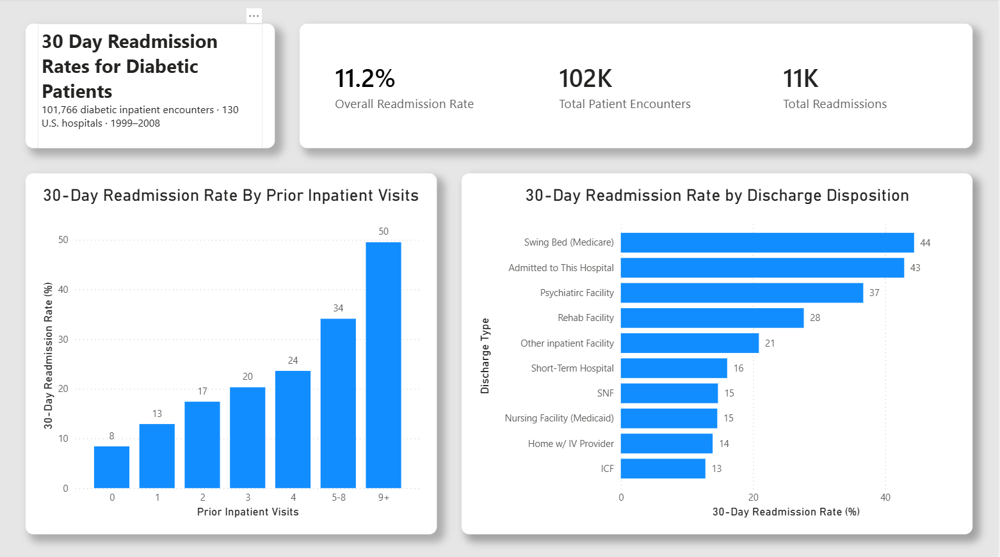
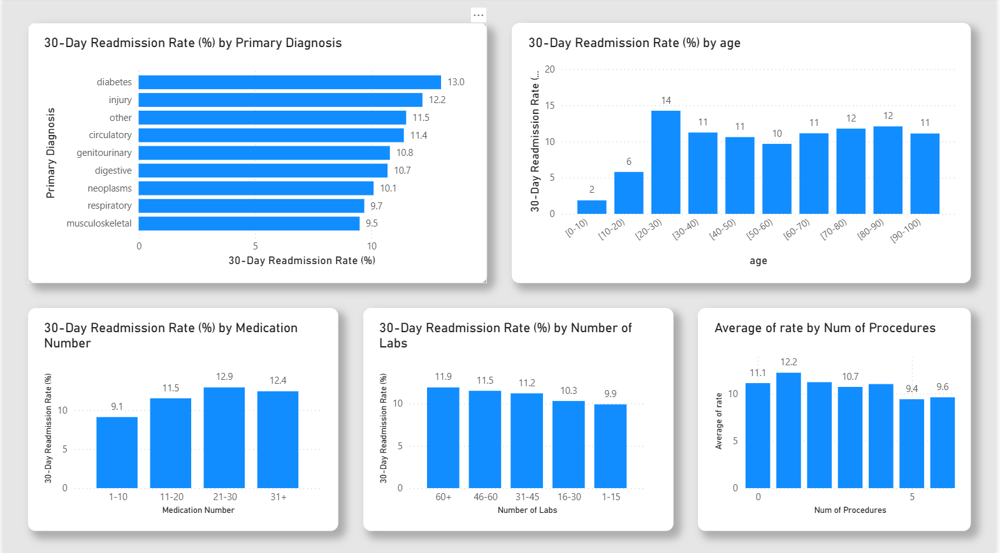

# Diabetes 30-Day Readmission Dashboard

An interactive Power BI dashboard analyzing 30-day hospital readmission patterns among inpatients with a documented diabetes diagnosis, built using the UCI Diabetes 130-US Hospitals dataset.

## Overview

This project explores factors associated with 30-day hospital readmission among patients with a documented diabetes diagnosis, using de-identified inpatient encounter data from 130 U.S. hospitals spanning 1999-2008 (101,766 diabetic inpatient encounters, an overall 30-day readmission rate of 11.2%). It was built as a self-directed learning project to develop skills in SQLite, relational data modeling, and Power BI/DAX, with a focus on healthcare analytics.

**Note on scope:** The dataset captures inpatient encounters where diabetes was a documented diagnosis — not admissions specifically for diabetes-related causes. This distinction shapes how findings are titled and interpreted throughout the dashboard. This project measures readmission patterns among diabetic inpatients broadly.

## Tech Stack

- **SQLite** — data ingestion and transformation
- **Python** — CSV ingestion pipeline
- **Power BI Desktop** — dashboard and visualization
- **DAX** — calculated measures and filter-context logic

## Data Source

[UCI Machine Learning Repository — Diabetes 130-US Hospitals for Years 1999-2008](https://archive.ics.uci.edu/dataset/296/diabetes+130-us+hospitals+for+years+1999-2008)

## Methodology

### 1. Data Ingestion & Cleaning (SQLite)
Raw encounter-level data was loaded into SQLite and cleaned prior to modeling.

### 2. Lookup Table Splitting
Several categorical fields were normalized out into separate lookup tables rather than left as repeated text values in the main encounter table, reducing redundancy and supporting cleaner joins.

### 3. Summary Views & SQL/DAX Division of Responsibility
Built summary views in SQL to handle heavier, one-time transformation and aggregation work, while using DAX for calculations that needed to respond dynamically to dashboard filters and slicers — a deliberate division of labor between the two layers rather than pushing all logic into one or the other.

### 4. Dashboard (Power BI)
Final dashboard polish included calculated measures, formatting, and layout work to present readmission patterns clearly across the patient population.

## Key Findings

### 1. "Frequent flyer" patients show a dramatically elevated risk of readmission

30-day readmission rate rose steadily and substantially with the number of prior inpatient visits, from 8% for first-time patients (0 prior visits) to 50% for patients with 9 or more prior inpatient visits.

This is one of the strongest and most consistent predictors identified in the dataset. Suggesting that patients with a documented history of repeated admissions should be prioritized for more intensive discharge planning and post-acute follow-up.

### 2. Discharge disposition had a major effect on readmission risk

Readmission rates varied substantially depending on where a patient was discharged to, ranging from 13% (Intermediate Care Facility) up to 44% (Swing Bed/Medicare)

Discharges to settings associated with lower acuity or transitional/skilled care (Swing Bed, further inpatient transfers, psychiatric facilities) showed markedly higher readmission rates than discharges to home-based or intermediate care settings.

### 3. Diabetes as the primary diagnosis carried the highest readmission rate of any diagnosis category

Among all primary diagnosis categories in the dataset, encounters where diabetes was the primary diagnosis, rather than a secondary or contributing condition, had the highest 30-day readmission rate at 13.0% — above injury (12.2%), circulatory conditions (11.4%), and every other diagnosis category, against an overall dataset readmission rate of 11.2%:

### Additional patterns observed
- **Age**: Readmission risk peaked in the 20-30 age group (14%) and was lowest for patients under 10 (2%), with a relatively stable 10-12% rate across most adult age brackets.
- **Medication count**: Readmission rate increased from 9.1% (1-10 medications) to a peak of 12.9% (21-30 medications), suggesting more complex medication regimens are associated with somewhat higher readmission risk.
- **Number of labs and procedures**: Showed comparatively modest effects on readmission rate relative to prior visits and discharge disposition, with rates generally clustering in the 9-12% range regardless of volume.

## Limitations

- The dataset captures inpatients with a documented diabetes diagnosis, not admissions specifically caused by diabetes. Findings describe readmission patterns in this broader population, not diabetes-specific care outcomes.
- Data covers encounters from 1999-2008 and does not reflect current clinical practice or more recent diabetes management standards.

## Dashboard Pages

1. **Overview** — headline KPI cards (overall readmission rate, total encounters, total readmissions), readmission rate by prior inpatient visits, readmission rate by discharge disposition
2. **Risk Factor Detail** — readmission rate by primary diagnosis, by age group, by medication count, by number of labs, and by number of procedures

## Screenshots 

## What I'd Do Differently

- Apply a fully DAX-driven approach on a future project to compare against this SQL/DAX split
- Apply Star Schema

